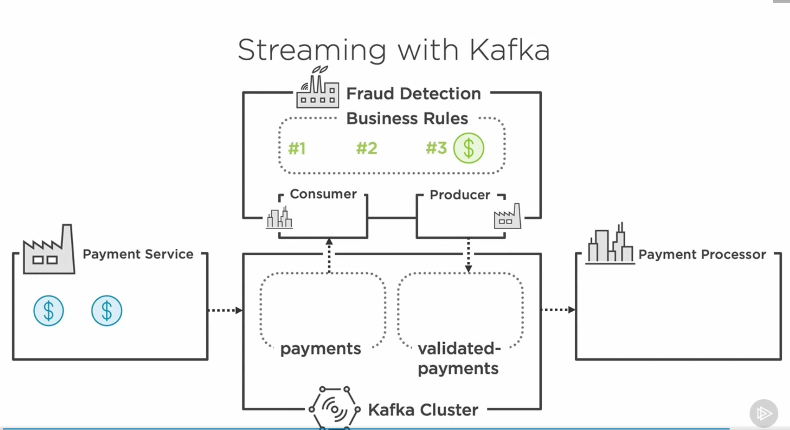

# System-Integration-Assignment-5

## Group Members

- Frederik Johnsen, cph-fj111@cphbusiness.dk
- Jean-Poul Leth-Møller, cph-jl360@cphbusiness.dk
- Mathias Parking, cph-mp525@cphbusiness.dk
- Magdalena Wawrzak cph-mw216@cphbusiness.dk
- Tobias Zimmermann cph-tz11@cphbusiness.dk

## 1.0 Project requirements

_All requirements for this project can be found in the following link:_

- [Objective for this assignment](./files/A6-MP4.pdf)

## 2.0 Services

- [Client Service](https://github.com/team-rocket-we-are-blasting-of-again/exam-transaction-client)
- [Payment Processor Service](https://github.com/team-rocket-we-are-blasting-of-again/exam-payment-processor)
- [Transaction Service](https://github.com/team-rocket-we-are-blasting-of-again/exam-transaction-service)
- [Payment Validator Service](https://github.com/team-rocket-we-are-blasting-of-again/exam-payment-validator)

## 3.0 About

Our system handles real time transactions of orders.

We revieve transaction requests, that are the validated and filtered and in the end our processor provides real time data through a websocket connection with the client.

### 3.1 Example flow

```http
POST https://localhost:7077/transaction
Content-Type: application/json

{
  "userEmail": "bob@thebuilder.com",
  "amount": 1000.0,
  "orderId": 10
}
```

This request will the be revieved by our transaction service, which will provide it with a unique id, and emit an event in to kafka.

The validator service then listens to this event using kafka streams and does validation on it. Ones it has been validated it will be sent to either the "invalid-transaction" topic or the "valid-trasaction" topic.

The payment processer listens to both the valid and invalid topic, and sends the response back to the client using a websocket.

### Visual diagram


